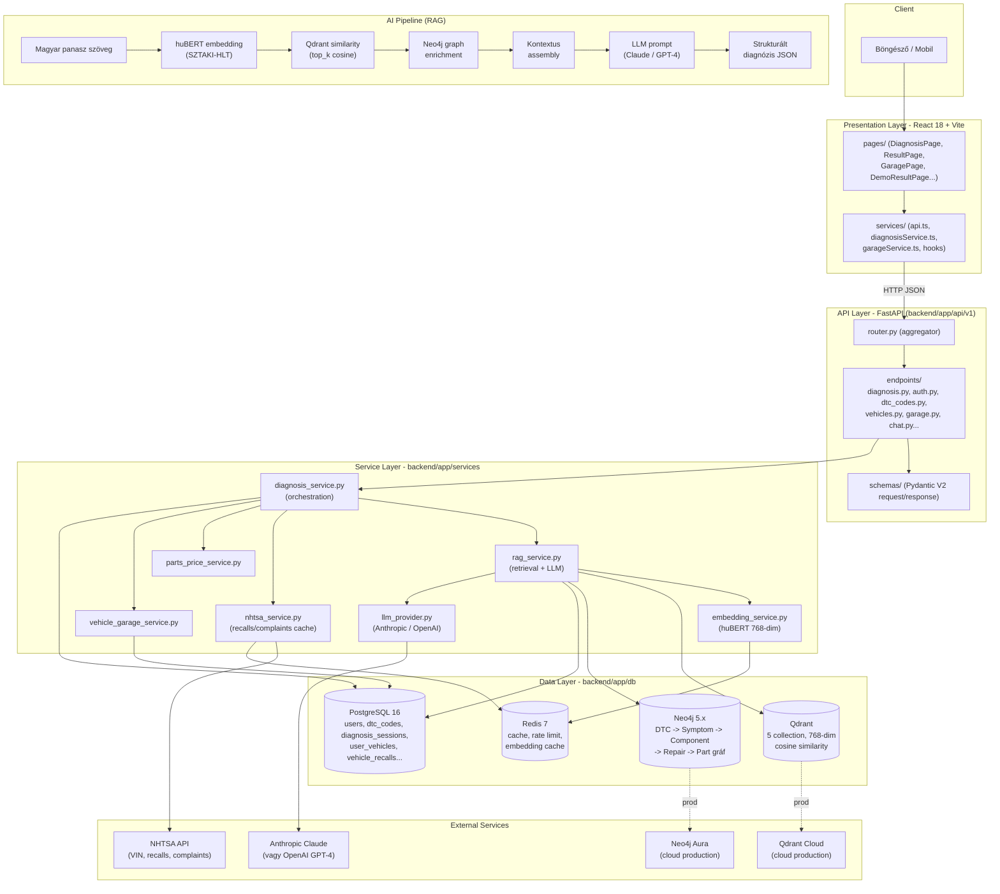

# AutoCognitix - Architektúra

Egy oldalas architektúra-áttekintés: rétegek, adatbázisok, AI pipeline, külső szolgáltatások.

---

## Rendszer diagram

---

## Layer breakdown

### 1. Presentation Layer (React 18 + TypeScript + Vite)
- **Cél:** SPA UI, form kezelés, valós idejű validáció, TanStack Query cache.
- **Kulcsfájlok:**
  - `frontend/src/main.tsx`, `frontend/src/App.tsx` - belépési pont és routing.
  - `frontend/src/pages/` - oldal komponensek (DiagnosisPage, ResultPage, GaragePage, VehicleDetailPage, DemoResultPage, ServiceComparisonPage, stb.).
  - `frontend/src/services/api.ts` - axios instance, base URL, JWT interceptor.
  - `frontend/src/services/diagnosisService.ts` - `analyzeDiagnosis()`, streaming SSE helper.
  - `frontend/src/services/hooks/` - TanStack Query hook-ok (`useAnalyzeDiagnosis`, `useDiagnosisHistory`).
  - `frontend/src/contexts/` - AuthContext, ToastContext.

### 2. API Layer (FastAPI)
- **Cél:** HTTP interfész, autentikáció (JWT), Pydantic validáció, OpenAPI docs.
- **Kulcsfájlok:**
  - `backend/app/main.py` - FastAPI app, middleware stack, lifespan.
  - `backend/app/api/v1/router.py` - aggregátor (diagnosis, auth, dtc, vehicles, garage, inspection, chat, calculator, services, health, metrics, newsletter).
  - `backend/app/api/v1/endpoints/diagnosis.py` - `POST /analyze`, `GET /{id}`, `GET /history`, `POST /analyze/stream`.
  - `backend/app/api/v1/schemas/` - Pydantic V2 request/response modellek.
  - `backend/app/core/config.py` - `Settings` (Pydantic BaseSettings).
  - `backend/app/core/rate_limit.py` - rate limit dekorátor (fail-closed Redis).
  - `backend/app/core/log_sanitizer.py` - `sanitize_log()` a CodeQL log injection ellen.
  - `backend/app/middleware/` - CORS, request logging, error handling.

### 3. Service Layer (üzleti logika)
- **Cél:** Rétegek közti orchestration, business rules, DB-független logika.
- **Kulcsfájlok:**
  - `backend/app/services/diagnosis_service.py::DiagnosisService.analyze_vehicle()` - 7 lépéses pipeline (VIN -> DTC validate -> symptom preprocess -> NHTSA -> RAG -> parts -> save).
  - `backend/app/services/rag_service.py::RAGService.diagnose()` - Qdrant + Neo4j + Postgres retrieval, reciprocal rank fusion, LLM hívás.
  - `backend/app/services/embedding_service.py::HungarianEmbeddingService` - huBERT singleton, batch, async wrapper (`embed_text_async`).
  - `backend/app/services/nhtsa_service.py` - NHTSA API kliens, VIN decode, Redis cache.
  - `backend/app/services/parts_price_service.py` - alkatrész árlekérdezés (Bárdi, Uni Autó, AUTODOC mapping).
  - `backend/app/services/vehicle_garage_service.py` - garázs CRUD, health score, emlékeztetők.
  - `backend/app/services/llm_provider.py` - provider absztrakció (Anthropic / OpenAI), retry, cache.
  - `backend/app/services/streaming_service.py` - SSE streaming LLM kimenethez.

### 4. Data Layer (4 adatbázis)
- **Cél:** Perzisztencia + domain-specifikus keresés.
- **Kulcsfájlok:**
  - `backend/app/db/postgres/session.py` - `get_db()` async session dependency.
  - `backend/app/db/postgres/models.py` - SQLAlchemy 2.0 modellek (~30 tábla).
  - `backend/app/db/postgres/repositories.py` - repository pattern (DTCCodeRepository, DiagnosisSessionRepository, stb.).
  - `backend/app/db/neo4j_models.py` - Neomodel node-ok és relációk, `get_diagnostic_path()`, `get_vehicle_common_issues()`.
  - `backend/app/db/qdrant_client.py` - `QdrantService` singleton, 5 collection, dimension validation, storage alerts.
  - `backend/app/db/redis_cache.py` - `RedisCacheService` singleton, circuit breaker, Lua-alapú atomic rate limit, TTL konstansok.

---

## Külső szolgáltatások

| Szolgáltatás | Célja | Használat helye |
|--------------|-------|-----------------|
| **NHTSA API** (`api.nhtsa.gov`) | VIN dekódolás, jármű visszahívások, panaszok. Ingyenes, kulcs nélküli. | `backend/app/services/nhtsa_service.py` - `decode_vin()`, `get_recalls()`, `get_complaints()`. Eredmény Redis-ben cache-elve (TTL 6h). |
| **Anthropic Claude** (vagy OpenAI GPT-4) | RAG pipeline végén a strukturált diagnózis generálás. | `backend/app/services/llm_provider.py` + `rag_service.py::generate_diagnosis()`. Provider választás az `.env`-ben (`LLM_PROVIDER=anthropic` vagy `openai`). |
| **Neo4j Aura** (`cloud.neo4j.com`) | Production graph DB - 26,816 node (Vehicles, DTC, Symptoms, Components, Repairs, Parts, Engines, Platforms). | Csatlakozás: `NEO4J_URI=neo4j+s://...`, `NEO4J_PASSWORD=...` env változókkal. `backend/app/db/neo4j_models.py`. |
| **Qdrant Cloud** (`cloud.qdrant.io`) | Production vector DB - 35,000+ vector, 768-dim cosine. | Csatlakozás: `QDRANT_URL`, `QDRANT_API_KEY`. 5 collection: `dtc_embeddings_hu`, `symptom_embeddings_hu`, `component_embeddings_hu`, `repair_embeddings_hu`, `known_issue_embeddings_hu`. |
| **HuggingFace Hub** | huBERT model (`SZTAKI-HLT/hubert-base-cc`) letöltés első indításkor. | `backend/app/services/embedding_service.py::_load_hubert_model()`. |
| **Railway** | Production PaaS - backend + frontend + PostgreSQL + Redis addonok. | `backend/railway.toml`, `frontend/railway.toml`, `docs/RAILWAY_DEPLOYMENT.md`. |

---

## HTTP flow (egyszerűsített)

1. Böngésző `POST /api/v1/diagnosis/analyze` JSON body-val.
2. CORS + rate limit middleware (`backend/app/middleware/`, `backend/app/core/rate_limit.py`).
3. JWT auth (opcionális - `get_optional_current_user`) + Pydantic validáció.
4. `DiagnosisService.analyze_vehicle()` orchestration (7 lépés, lásd `docs/DATA_FLOW.md`).
5. Párhuzamos DB hívások: Postgres DTC lookup + Qdrant similarity + Neo4j graph traverse + NHTSA cache/API.
6. LLM hívás strukturált JSON outputtal.
7. Postgres mentés (`diagnosis_sessions`) + Redis cache invalidation.
8. `DiagnosisResponse` (Pydantic) JSON szerializálva, 201 Created.

Részletes step-by-step trace: **`docs/DATA_FLOW.md`**.
