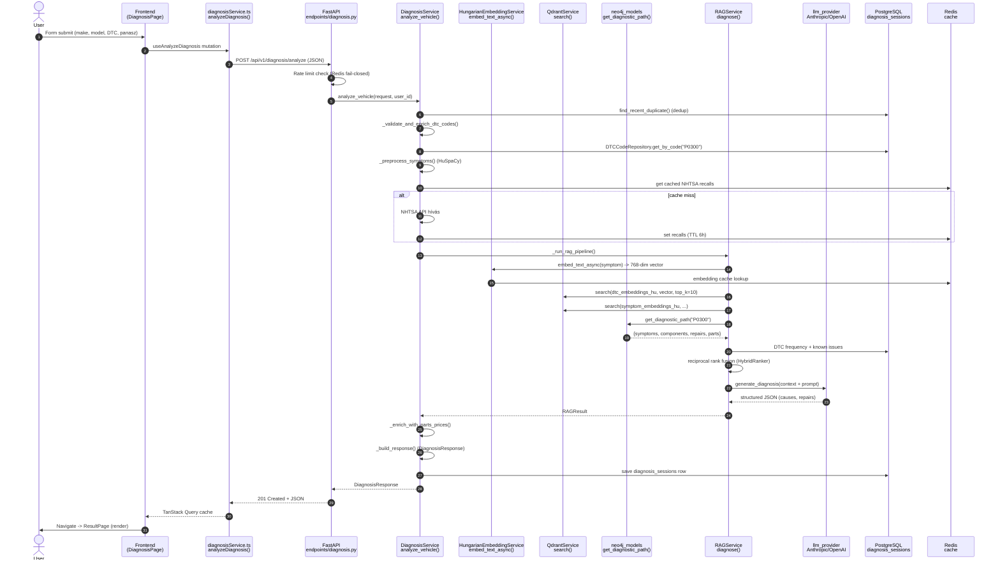

# AutoCognitix - Data Flow

Egy konkrét diagnózis kérés végigkövetése step-by-step: mit csinál a frontend, hol megy át a backend, melyik DB-t kérdezi le, hogyan áll össze az LLM válasz.

Példa kérés: Volkswagen Golf 2018, DTC `P0300`, panasz `"A motor rázkódik alapjáraton."`.

---

## Sequence diagram

---

## Step-by-step trace

### 1. Form submit (Frontend)
**Fájl:** `frontend/src/pages/DiagnosisPage.tsx`
**Kulcs:** `handleSubmit()` callback (useCallback), `useAnalyzeDiagnosis` mutation.
Összegyűjti a form értékeit (`vehicle_make`, `vehicle_model`, `vehicle_year`, `dtc_codes[]`, `symptoms`, opcionális `vin`), validálja, és meghívja a mutation-t. Hiba esetén `useToast` értesítést mutat, siker esetén `navigate('/result/{id}')`.

### 2. HTTP POST küldés
**Fájl:** `frontend/src/services/diagnosisService.ts`
**Kulcs:** `analyzeDiagnosis(data: DiagnosisFormData)` - 138-162. sor.
Átalakítja a form adatot `DiagnosisRequest` formátumba, meghívja `api.post<DiagnosisResponse>('/diagnosis/analyze', request)`-t. Az `api` axios instance (`frontend/src/services/api.ts`) automatikusan csatolja a JWT cookie-t és kezeli a 401/429 hibákat.

### 3. FastAPI route
**Fájl:** `backend/app/api/v1/endpoints/diagnosis.py`
**Kulcs:** `@router.post("/analyze")` -> `analyze_vehicle()` - 212. sor.
- Rate limit ellenőrzés: `check_diagnosis_rate_limit(request)`.
- Opcionális auth: `get_optional_current_user()` (ha JWT cookie van, user_id kinyeres).
- Pydantic body parse: `DiagnosisRequest` (schemas/diagnosis.py).
- Meghívja: `DiagnosisService(db).analyze_vehicle(request, user_id=...)`.

### 4. Service orchestration
**Fájl:** `backend/app/services/diagnosis_service.py`
**Kulcs:** `DiagnosisService.analyze_vehicle()` - 140. sor.
Hét lépés szekvenciálisan:
- **Step 0:** Duplicate detection (`find_recent_duplicate` - 24h ablak, dtc_codes + vin).
- **Step 1:** VIN decode ha van VIN (`_decode_vin()` - NHTSA API + Redis cache).
- **Step 2:** DTC validálás (`_validate_and_enrich_dtc_codes()` - Postgres lookup, format check).
- **Step 3:** Symptom preprocess (`_preprocess_symptoms()` - HuSpaCy tokenizer, NFC normalizálás).
- **Step 4:** NHTSA recalls + complaints párhuzamosan (`_fetch_nhtsa_data()`, asyncio.gather).
- **Step 5:** RAG pipeline (`_run_rag_pipeline()`).
- **Step 5.5:** Alkatrész árak (`_enrich_with_parts_prices()`).
- **Step 6-7:** Response build + Postgres mentés (`_build_response()`, `_save_diagnosis_session()`).

### 5. Hungarian embedding (huBERT)
**Fájl:** `backend/app/services/embedding_service.py`
**Kulcs:** `embed_text_async(text, preprocess=True)` - 648. sor.
- Singleton modell (`HungarianEmbeddingService._instance`), lazy load.
- Modell: `SZTAKI-HLT/hubert-base-cc` (Hungarian BERT, 768-dim).
- Async wrapper ThreadPoolExecutor-ra (GPU/CPU inference).
- Redis embedding cache kulcs: `embed:{sha256(text)[:64]}` (TTL 1h, `CacheTTL.EMBEDDINGS`).
- Mean pooling + attention mask alapú vektor kinyerés.

### 6. Qdrant vector search
**Fájl:** `backend/app/db/qdrant_client.py`
**Kulcs:** `QdrantService.search(collection_name, query_vector, limit, filter_conditions, score_threshold)` - 166. sor.
- Collection-ok: `dtc_embeddings_hu`, `symptom_embeddings_hu`, `component_embeddings_hu`, `repair_embeddings_hu`, `known_issue_embeddings_hu`.
- Distance: `COSINE`. Dimension validation: 768 (`EXPECTED_DIMENSION`).
- Payload szűrők: `category`, `severity`, `vehicle_make`, `system`, `_embedding_model_version`.
- Threshold alapértelmezett: `0.5` (score_threshold).

### 7. Neo4j graph enrichment
**Fájl:** `backend/app/db/neo4j_models.py`
**Kulcs:** `get_diagnostic_path(dtc_code)` - 347. sor és `get_vehicle_common_issues(make, model, year)` - 445. sor.
- Bejárja a gráfot: `DTCNode -[CAUSES]-> SymptomNode`, `DTCNode -[INDICATES_FAILURE_OF]-> ComponentNode -[REPAIRED_BY]-> RepairNode -[USES_PART]-> PartNode`.
- Vehicle-specifikus: `VehicleNode -[HAS_COMMON_ISSUE]-> DTCNode` gyakoriság és occurrence_count adatokkal.
- Fallback: ha Neo4j nem elérhető, `is_neo4j_available()` gyorsan fail-el és üres struct-ot ad vissza (graceful degradation).

### 8. RAG retrieval + context assembly
**Fájl:** `backend/app/services/rag_service.py`
**Kulcs:** `RAGService.diagnose()` - 1112. sor, `assemble_context()` - 737. sor, `HybridRanker.reciprocal_rank_fusion()` - 282. sor.
- Három source párhuzamosan (`asyncio.gather`): Qdrant + Neo4j + Postgres.
- Reciprocal Rank Fusion (RRF): `score(doc) = sum(1 / (k + rank_i))` minden source-ra - összevont ranking.
- ContextCache TTL 300s, max 100 bejegyzés (LRU).
- `RAGContext` objektum tartalmazza: `retrieved_items`, `vehicle_info`, `dtc_details`, `formatted_string` (LLM prompt-hoz).

### 9. LLM hívás
**Fájl:** `backend/app/services/rag_service.py::generate_diagnosis()` (977. sor) + `backend/app/services/llm_provider.py`
- Provider absztrakció: Anthropic Claude (default) vagy OpenAI GPT-4, `.env` LLM_PROVIDER változó.
- Prompt template: `backend/app/prompts/` - Hungarian + direktív instrukciók (mérési értékek, szerszámok, gyökérok elemzés - Sprint 7.5).
- JSON-mode válasz: `probable_causes[]`, `recommended_repairs[]`, `tools_needed[]`, `parts_with_prices[]`.
- Retry + exponential backoff (`llm_provider.py` retry logikával).
- Streaming verzió külön: `backend/app/services/streaming_service.py` (SSE, `POST /analyze/stream`).

### 10. Response assembly + perzisztálás
**Fájl:** `backend/app/services/diagnosis_service.py::_build_response()` (923. sor) + `_save_diagnosis_session()` (1152. sor).
- Pydantic `DiagnosisResponse` összerak: causes, repairs, parts, total_cost_estimate, related_recalls (NHTSA badge), sources (Qdrant score-okkal), urgency level, confidence_score.
- `_determine_urgency()` - severity + confidence alapján: LOW / MEDIUM / HIGH / CRITICAL.
- Mentés: `DiagnosisSessionRepository.create()` - Postgres `diagnosis_sessions` táblába (JSONB `diagnosis_result` mező).
- Cache invalidation: `invalidate_diagnosis_cache(session_id, user_id)` (`backend/app/db/redis_cache.py`).

### 11. Frontend render
**Fájl:** `frontend/src/pages/ResultPage.tsx`.
- TanStack Query automatikusan cache-eli a választ az `id` alapján.
- Komponensek: `ProbableCausesCard`, `RepairRecommendations`, `PartsTable`, `TotalCostCard`, `RecallBadge` (piros NHTSA figyelmeztetés, Sprint 10), `SourcesList`.
- Megosztás URL: `/result/{id}` (perzisztens, GET `/api/v1/diagnosis/{id}` kérdezi le újra F5 után).

---

## Hibakezelés és fallback-ek

| Komponens | Kiesés esetén |
|-----------|---------------|
| **Qdrant** | `rag_service.py` fallback kulcsszavas Postgres keresésre. |
| **Neo4j** | `is_neo4j_available()` 30s cache, üres gráf -> LLM csak Qdrant + Postgres kontextussal dolgozik. |
| **Redis** | Circuit breaker (5 hiba -> 30s cooldown). Cache-miss = DB lekérdezés. Rate limit **fail-closed**. |
| **NHTSA API** | Cache hit prioritás, miss + hiba -> `recalls=[], complaints=[]`, folyamat folytatódik. |
| **LLM** | `llm_provider.py` retry exponential backoff (max 3), teljes kudarc -> `_fallback_diagnosis()` statikus Postgres-alapú eredmény (731. sor). |
